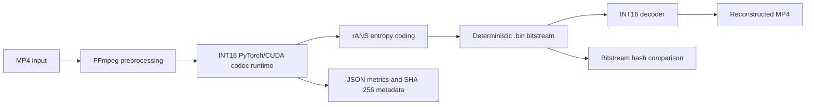

# Deterministic Neural Video Codec

**10-second version:** this project compresses an MP4 into a deterministic
INT16 `.bin` video bitstream, decodes it back to MP4, and verifies the result
with SHA-256 hashes and video quality metrics.

It is derived from the public Microsoft DCVC / DCVC-RT project family. This
repo is independent and focuses on my deterministic INT16 runtime work.

[](LICENSE)
[](https://www.python.org/)
[](https://developer.nvidia.com/cuda-downloads)

## Project Snapshot

| Question | Answer |
|---|---|
| What is it? | A deterministic INT16 neural video codec runtime. |
| What does it do? | MP4 input -> compressed `.bin` bitstream -> reconstructed MP4. |
| Upstream lineage | Derived from Microsoft DCVC / DCVC-RT. |
| Role fit | Software Engineer I, Backend Engineer I, ML Systems Engineer I. |
| Skills shown | Python, PyTorch, CUDA/C++, FFmpeg, rANS entropy coding, testing. |
| Proof | 35 tests passed; 2593-frame 1280x720 video encoded and decoded. |

Useful links:

- [Demo GIF](assets/demo_before_after.gif)
- [Quickstart](#quickstart)
- [Measured results](#measured-results)
- [Model bundle release](https://github.com/mathew-felix/deterministic-neural-video-codec/releases/tag/v1.0.0)

## Engineering Focus

This is presented as a software engineering project. The work is focused on
making a neural codec runtime usable, testable, and reproducible:

- Runtime packaging and standalone module structure.
- Command-line encode/decode tools.
- CUDA/PyTorch integration and native extension setup.
- Setup validation with clear environment checks.
- SHA-256 bitstream verification and JSON metadata.
- Measured local demo results and documented limitations.

## What I Built

The upstream Microsoft DCVC project and DCVC-RT implementation provide the
neural codec lineage. My contribution is the software engineering layer around
the deterministic INT16 runtime:

- MP4 encode/decode command-line tools.
- Signed INT16 codec path around a DCVC-RT-family model flow.
- CUDA/PyTorch runtime integration.
- rANS entropy-coded `.bin` output.
- SHA-256 and byte-level bitstream comparison.
- Setup checker, tests, demo assets, and measured result artifacts.
- Small Python API in [`codec.py`](codec.py) for programmatic encode/decode.

This is not a Microsoft product and is not affiliated with, endorsed by, or
sponsored by Microsoft. See [docs/provenance.md](docs/provenance.md).

## Architecture



## Quickstart

These commands download the v1.0.0 model bundle and run a short smoke test.
They assume you have an NVIDIA CUDA GPU and FFmpeg on `PATH`.

Windows PowerShell:

```powershell
git clone https://github.com/mathew-felix/deterministic-neural-video-codec.git
cd deterministic-neural-video-codec

python -m venv .venv
.\.venv\Scripts\Activate.ps1

python bootstrap_runtime.py
Copy-Item config\config.example.yaml config\config.yaml
python scripts\download_models.py --sha256 c1fc2341d3faf28f16b8e77c0869aecddade674aa0b43be2b64c516f49a8554f

python scripts\check_setup.py --input_mp4 video.mp4 --require_config --require_cuda --require_bundle
python -m pytest tests\ -q

python encode_mp4_to_bin.py --input_mp4 video.mp4 --frames 2 --output_dir outputs\video_smoke
python decode_bin_to_mp4.py --input_bin outputs\video_smoke\video_1280x720_30_2f_q32.bin
python tools\compare_bitstreams.py outputs\video_smoke\video_1280x720_30_2f_q32.bin
```

Linux:

```bash
git clone https://github.com/mathew-felix/deterministic-neural-video-codec.git
cd deterministic-neural-video-codec

python3 -m venv .venv
. .venv/bin/activate

python bootstrap_runtime.py
cp config/config.example.yaml config/config.yaml
python scripts/download_models.py --sha256 c1fc2341d3faf28f16b8e77c0869aecddade674aa0b43be2b64c516f49a8554f

python scripts/check_setup.py --input_mp4 video.mp4 --require_config --require_cuda --require_bundle
python -m pytest tests/ -q

python encode_mp4_to_bin.py --input_mp4 video.mp4 --frames 2 --output_dir outputs/video_smoke
python decode_bin_to_mp4.py --input_bin outputs/video_smoke/video_1280x720_30_2f_q32.bin
python tools/compare_bitstreams.py outputs/video_smoke/video_1280x720_30_2f_q32.bin
```

Expected smoke-test files:

```text
outputs/video_smoke/video_1280x720_30_2f_q32.bin
outputs/video_smoke/video_1280x720_30_2f_q32.json
outputs/video_smoke/video_1280x720_30_2f_q32_decoded.mp4
outputs/video_smoke/video_1280x720_30_2f_q32_decoded_decode.json
```

Example terminal output:

```text
{
  "codec": "dcvc_rt_int16",
  "mode": "encode",
  "bitstream_path": "outputs/video_smoke/video_1280x720_30_2f_q32.bin",
  "frames_encoded": 2,
  "bitstream_sha256": "<sha256 written by the local run>"
}
```

## Demo

Original video versus decoded reconstruction:


The `.bin` file is the compressed codec output. The decoded MP4 is generated
only so the reconstruction can be viewed in a normal media player.

| Artifact | Size |
|---|---:|
| Original MP4 | 84,089,033 bytes, 80.19 MiB |
| Deterministic codec bitstream | 4,817,350 bytes, 4.59 MiB |
| Decoded preview MP4 | 39,068,735 bytes, 37.26 MiB |

See [docs/demo.md](docs/demo.md) for the demo-generation commands.

For presentations, use:

- [Demo presentation guide](docs/demo_presentation.md)
- [Representative terminal output](assets/demo_terminal_output.txt)

## Measured Results

Measured locally on an NVIDIA GeForce RTX 3070 Ti Laptop GPU, Python 3.12.0,
PyTorch 2.2.2+cu121, CUDA 12.1 runtime, and driver 596.21.

| Result | Value |
|---|---:|
| Tests | 35 passed |
| Full video encoded/decoded | 2593 frames |
| Resolution | 1280x720 |
| FPS | 30 |
| QP I/P | 32 / 32 |
| Bitstream size | 4,817,350 bytes |
| Bitrate | 445.8789 kbps |
| BPP | 0.016127 |
| Average encode time | 223.5898 ms/frame |
| Average decode time | 207.8080 ms/frame |
| Average RGB PSNR | 28.8969 dB |
| Average RGB MS-SSIM | 0.933624 |

Bitstream SHA-256:

```text
d837ca00cc367c50a63d25ddff19d53a7cc7496cd66099ab73047249c4ad09ed
```

Same-machine determinism smoke test:

| Check | Value |
|---|---:|
| Frames | 32 |
| SHA-256 equal | true |
| Bytewise equal | true |

Full measured payload:
[`assets/metrics/video_full_local_2026-05-14.json`](assets/metrics/video_full_local_2026-05-14.json)

A short encode/decode smoke test using `../data/test/multi_cow_night_1.mp4` is
recorded in [docs/results.md](docs/results.md).

## Python API

The top-level runtime can be used from Python through [`codec.py`](codec.py).
This wraps the same command-line encoder and decoder used in the demo.

```python
import codec

result = codec.compress("video.mp4", "outputs", frames=2, qp=32)
codec.decompress(result["bitstream_path"])
```

## Repository Structure

```text
deterministic-neural-video-codec/
  README.md                    recruiter-friendly project overview
  encode_mp4_to_bin.py          MP4 -> deterministic .bin encoder
  decode_bin_to_mp4.py          .bin -> reconstructed MP4 decoder
  codec.py                      small Python API around encode/decode
  bootstrap_runtime.py          dependency and native-extension bootstrap
  build_int16_cuda.py           optional INT16 CUDA extension build
  scripts/check_setup.py        local setup validator
  scripts/quality_metrics.py    PSNR/MS-SSIM evaluator
  tools/compare_bitstreams.py   SHA-256 and bytewise comparison
  src/                          INT16 runtime, model wrappers, CUDA/C++ code
  tests/                        unit, packaging, entropy, and equivalence tests
  docs/                         architecture, validation, demo, limitations
  assets/                       small demo and metrics artifacts
  models/                       local model bundles, not committed
  outputs/                      generated runs, not committed
```

## Known Limitations

- Requires an NVIDIA CUDA GPU for real encode/decode.
- Not real-time in the current tested setup.
- Native CUDA/C++ extensions require build tools.
- Model bundle files are not committed and must be downloaded or built locally.
- Deterministic claims require the same equivalence class: input frames, bundle
  SHA-256, QP, frame count, reset interval, runtime flags, source revision,
  PyTorch/CUDA versions, and native extension behavior.
- Cross-device claims should be treated as validation tasks until the release
  bundle URL and hash are verified on each target machine.

## Resume Bullets

- Packaged a deterministic INT16 neural video codec runtime with PyTorch, CUDA
  extensions, FFmpeg, and rANS entropy coding to generate hash-checkable video
  bitstreams.
- Built command-line MP4 encode/decode workflows with setup validation, runtime
  metadata, SHA-256 bitstream comparison, and PSNR/MS-SSIM quality measurement.
- Validated the runtime on a 2593-frame 1280x720 video with 35 passing tests
  covering entropy coding, bitstream comparison, INT16 backend behavior, and
  CUDA kernel parity.

See [docs/resume_bullets.md](docs/resume_bullets.md) for a copy-ready version.

## More Documentation

- [Architecture](docs/architecture.md)
- [Demo](docs/demo.md)
- [Demo presentation guide](docs/demo_presentation.md)
- [Results](docs/results.md)
- [Validation protocol](docs/validation.md)
- [Model setup](docs/model_setup.md)
- [GitHub release text](docs/release_notes_v1.0.0.md)
- [Reproducibility guide](REPRODUCE.md)
- [Known provenance](docs/provenance.md)

## License

This project is licensed under the Apache License 2.0. Portions of this work
are derived from the Microsoft DCVC project, copyright Microsoft Corporation,
licensed under the MIT License. See [NOTICE](NOTICE).
