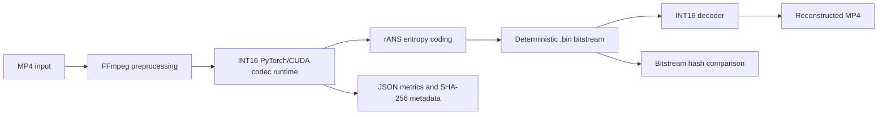

# Deterministic INT16 Runtime for DCVC-RT

Research software for reproducible neural video compression using the
Microsoft DCVC / DCVC-RT model family.

> This project does **not** introduce a new neural codec architecture.
> My contribution is the deterministic INT16 runtime, integration,
> validation, and reproducibility tooling built around DCVC-RT.

---

## Research Motivation

Neural video codecs can produce different entropy-coded bitstreams when small
numerical differences occur across runtime environments.

This project explores an INT16-oriented execution path designed to make
bitstream generation more reproducible and easier to validate in
edge-to-server video compression workflows.

---

## What I Built

- INT16-oriented DCVC-RT-family encode/decode runtime
- PyTorch and CUDA/C++ integration
- rANS entropy-coded `.bin` bitstreams
- FFmpeg-based MP4 preprocessing and reconstruction
- SHA-256 and byte-level bitstream validation
- Runtime metadata and automated tests

---

## Architecture



## Validation

The runtime was evaluated on a 2,593-frame, 1280×720, 30 FPS video.

| Metric | Result |
| --- | ---: |
| Bitstream size | 4.82 MB |
| Mean RGB PSNR | 28.90 dB |
| Mean RGB MS-SSIM | 0.9336 |
| Automated tests | 35 passed |

A same-environment determinism test produced identical SHA-256 hashes and
byte-for-byte identical bitstreams across repeated runs.

These results represent one tested configuration and are intended as
implementation-validation results rather than a comprehensive codec benchmark.

---

## Research Context

This runtime supports my broader work in neural video compression and was used
in the following accepted paper:

> **FaunaCodec: ROI-Aware Video Compression and Reconstruction for Wildlife Monitoring**  
> Mykhailo Sakevych, **Felix Mathew**, and Vangelis Metsis  
> Accepted short paper, **IEEE ICTAI 2026**

FaunaCodec studies ROI-aware wildlife video compression across neural and
conventional codecs. This repository focuses specifically on the deterministic
neural codec runtime and reproducibility layer.

---


## Quickstart

These commands download the v1.0.0 model bundle and run a short smoke test.
They assume you have an NVIDIA CUDA GPU and FFmpeg on `PATH`.

Windows PowerShell:

```powershell
git clone https://github.com/mathew-felix/deterministic-neural-video-codec.git
cd deterministic-neural-video-codec

python -m venv .venv
.\.venv\Scripts\Activate.ps1

python bootstrap_runtime.py
Copy-Item config\config.example.yaml config\config.yaml
python scripts\download_models.py --sha256 c1fc2341d3faf28f16b8e77c0869aecddade674aa0b43be2b64c516f49a8554f

python scripts\check_setup.py --input_mp4 video.mp4 --require_config --require_cuda --require_bundle
python -m pytest tests\ -q

python encode_mp4_to_bin.py --input_mp4 video.mp4 --frames 2 --output_dir outputs\video_smoke
python decode_bin_to_mp4.py --input_bin outputs\video_smoke\video_1280x720_30_2f_q32.bin
python tools\compare_bitstreams.py outputs\video_smoke\video_1280x720_30_2f_q32.bin
```

Linux:

```bash
git clone https://github.com/mathew-felix/deterministic-neural-video-codec.git
cd deterministic-neural-video-codec

python3 -m venv .venv
. .venv/bin/activate

python bootstrap_runtime.py
cp config/config.example.yaml config/config.yaml
python scripts/download_models.py --sha256 c1fc2341d3faf28f16b8e77c0869aecddade674aa0b43be2b64c516f49a8554f

python scripts/check_setup.py --input_mp4 video.mp4 --require_config --require_cuda --require_bundle
python -m pytest tests/ -q

python encode_mp4_to_bin.py --input_mp4 video.mp4 --frames 2 --output_dir outputs/video_smoke
python decode_bin_to_mp4.py --input_bin outputs/video_smoke/video_1280x720_30_2f_q32.bin
python tools/compare_bitstreams.py outputs/video_smoke/video_1280x720_30_2f_q32.bin
```

Expected smoke-test files:

```text
outputs/video_smoke/video_1280x720_30_2f_q32.bin
outputs/video_smoke/video_1280x720_30_2f_q32.json
outputs/video_smoke/video_1280x720_30_2f_q32_decoded.mp4
outputs/video_smoke/video_1280x720_30_2f_q32_decoded_decode.json
```

Example terminal output:

```text
{
  "codec": "dcvc_rt_int16",
  "mode": "encode",
  "bitstream_path": "outputs/video_smoke/video_1280x720_30_2f_q32.bin",
  "frames_encoded": 2,
  "bitstream_sha256": "<sha256 written by the local run>"
}
```

## Demo

Original video versus decoded reconstruction:


The `.bin` file is the compressed codec output. The decoded MP4 is generated
only so the reconstruction can be viewed in a normal media player.

| Artifact | Size |
|---|---:|
| Original MP4 | 84,089,033 bytes, 80.19 MiB |
| Deterministic codec bitstream | 4,817,350 bytes, 4.59 MiB |
| Decoded preview MP4 | 39,068,735 bytes, 37.26 MiB |

See [docs/demo.md](docs/demo.md) for the demo-generation commands.

For presentations, use:

- [Demo presentation guide](docs/demo_presentation.md)
- [Representative terminal output](assets/demo_terminal_output.txt)

## Measured Results

Measured locally on an NVIDIA GeForce RTX 3070 Ti Laptop GPU, Python 3.12.0,
PyTorch 2.2.2+cu121, CUDA 12.1 runtime, and driver 596.21.

| Result | Value |
|---|---:|
| Tests | 35 passed |
| Full video encoded/decoded | 2593 frames |
| Resolution | 1280x720 |
| FPS | 30 |
| QP I/P | 32 / 32 |
| Bitstream size | 4,817,350 bytes |
| Bitrate | 445.8789 kbps |
| BPP | 0.016127 |
| Average encode time | 223.5898 ms/frame |
| Average decode time | 207.8080 ms/frame |
| Average RGB PSNR | 28.8969 dB |
| Average RGB MS-SSIM | 0.933624 |

Bitstream SHA-256:

```text
d837ca00cc367c50a63d25ddff19d53a7cc7496cd66099ab73047249c4ad09ed
```

Same-machine determinism smoke test:

| Check | Value |
|---|---:|
| Frames | 32 |
| SHA-256 equal | true |
| Bytewise equal | true |

Full measured payload:
[`assets/metrics/video_full_local_2026-05-14.json`](assets/metrics/video_full_local_2026-05-14.json)

A short encode/decode smoke test using `../data/test/multi_cow_night_1.mp4` is
recorded in [docs/results.md](docs/results.md).

## Python API

The top-level runtime can be used from Python through [`codec.py`](codec.py).
This wraps the same command-line encoder and decoder used in the demo.

```python
import codec

result = codec.compress("video.mp4", "outputs", frames=2, qp=32)
codec.decompress(result["bitstream_path"])
```

## Repository Structure

```text
deterministic-neural-video-codec/
  README.md                    recruiter-friendly project overview
  encode_mp4_to_bin.py          MP4 -> deterministic .bin encoder
  decode_bin_to_mp4.py          .bin -> reconstructed MP4 decoder
  codec.py                      small Python API around encode/decode
  bootstrap_runtime.py          dependency and native-extension bootstrap
  build_int16_cuda.py           optional INT16 CUDA extension build
  scripts/check_setup.py        local setup validator
  scripts/quality_metrics.py    PSNR/MS-SSIM evaluator
  tools/compare_bitstreams.py   SHA-256 and bytewise comparison
  src/                          INT16 runtime, model wrappers, CUDA/C++ code
  tests/                        unit, packaging, entropy, and equivalence tests
  docs/                         architecture, validation, demo, limitations
  assets/                       small demo and metrics artifacts
  models/                       local model bundles, not committed
  outputs/                      generated runs, not committed
```

## Limitations

- Current validation is primarily same-environment.
- Cross-device bit-exact reproducibility should be verified explicitly.
- The current implementation requires an NVIDIA CUDA GPU.
- The tested runtime is not real-time.
- The project does not claim a new codec architecture or state-of-the-art
  rate-distortion performance.

---

## Related Work

- [M.S. Thesis Record](https://hdl.handle.net/10877/24790)
- [ROI-Aware Wildlife Video Compression Project](https://github.com/mathew-felix/roi-wildlife-video-compression)

---

## Author

**Felix Mathew**  
M.S. Computer Science, Texas State University

Research interests: Neural Video Compression, Computer Vision, Edge AI,
Multimedia Systems, Efficient Machine Learning

- [GitHub](https://github.com/mathew-felix)
- [LinkedIn](https://www.linkedin.com/in/mathew-felix)

---

## Attribution

The neural codec architecture is derived from the public Microsoft DCVC /
DCVC-RT project family.

This repository contains my runtime adaptation, deterministic execution path,
validation tooling, and reproducibility infrastructure.

See [`NOTICE`](NOTICE) and [`docs/provenance.md`](docs/provenance.md) for
additional attribution details.

---

## License

Apache License 2.0.
