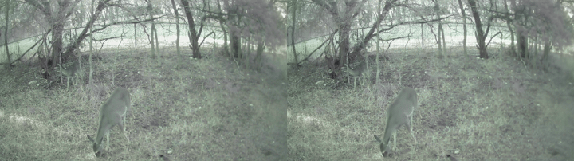

# Recruiter Demo

This demo shows the original `video.mp4` beside the decoded reconstruction from
the deterministic INT16 codec bitstream.



Left: original video. Right: decoded reconstruction.

## Compression Result

| Artifact | Size |
|---|---:|
| Original MP4 | 84,089,033 bytes, 80.19 MiB |
| Deterministic codec bitstream | 4,817,350 bytes, 4.59 MiB |
| Decoded preview MP4 | 39,068,735 bytes, 37.26 MiB |

The `.bin` file is the compressed codec output. The decoded MP4 is for viewing
the reconstruction in a normal media player.

| Metric | Value |
|---|---:|
| Size reduction versus original MP4 | 94.27% |
| Compression ratio versus original MP4 | 17.45x smaller |
| Full-video frames tested | 2593 |
| Resolution | 1280x720 |
| FPS | 30 |
| Average RGB PSNR | 28.8969 dB |
| Average RGB MS-SSIM | 0.933624 |

## Short Demo Commands

```powershell
python scripts\check_setup.py --input_mp4 video.mp4 --require_config --require_cuda --require_bundle
python encode_mp4_to_bin.py --input_mp4 video.mp4 --frames 2 --output_dir outputs\video_smoke
python decode_bin_to_mp4.py --input_bin outputs\video_smoke\video_1280x720_30_2f_q32.bin
```

Expected files:

```text
outputs/video_smoke/video_1280x720_30_2f_q32.bin
outputs/video_smoke/video_1280x720_30_2f_q32.json
outputs/video_smoke/video_1280x720_30_2f_q32_decoded.mp4
outputs/video_smoke/video_1280x720_30_2f_q32_decoded_decode.json
```

Representative terminal output for a portfolio walkthrough is stored in
[`assets/demo_terminal_output.txt`](../assets/demo_terminal_output.txt).

For a screen-recording storyboard and talk track, use
[`docs/demo_presentation.md`](demo_presentation.md).

## Rebuild The GIF

```powershell
ffmpeg -y `
  -ss 00:00:10 -t 6 -i video.mp4 `
  -ss 00:00:10 -t 6 -i outputs\video_full\video_1280x720_30_2593f_q32_decoded.mp4 `
  -filter_complex "[0:v]scale=480:-2,setpts=PTS-STARTPTS[left];[1:v]scale=480:-2,setpts=PTS-STARTPTS[right];[left][right]hstack=inputs=2,fps=12,split[s0][s1];[s0]palettegen[p];[s1][p]paletteuse" `
  assets\demo_before_after.gif
```

## Short Pitch

This is a video compression project. It takes an MP4, creates a compact `.bin`
codec bitstream, decodes it back to MP4, and verifies the result with SHA-256
and quality metrics.
